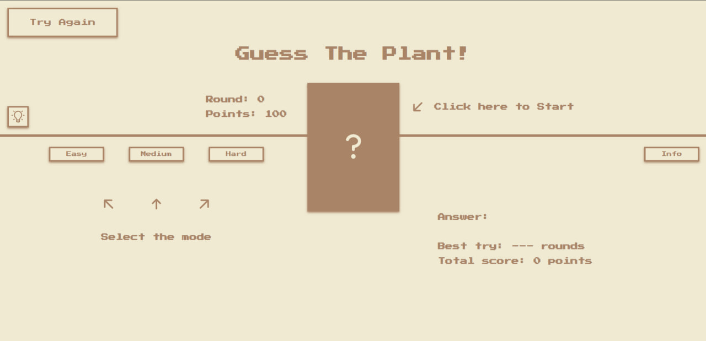
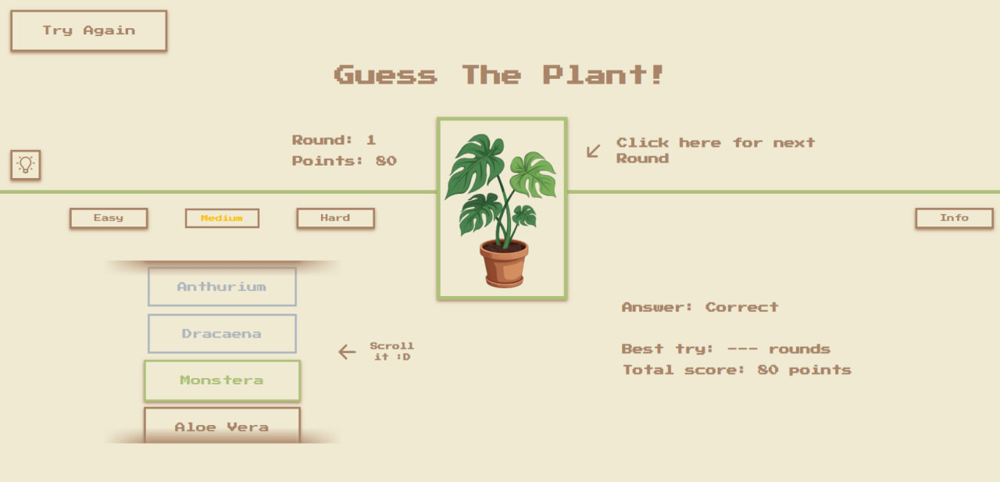
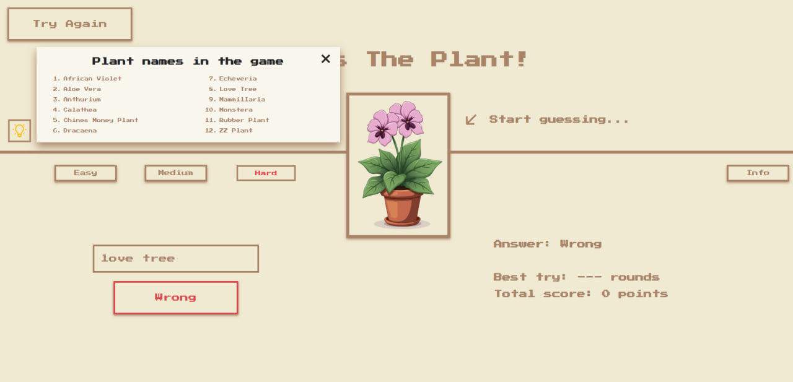
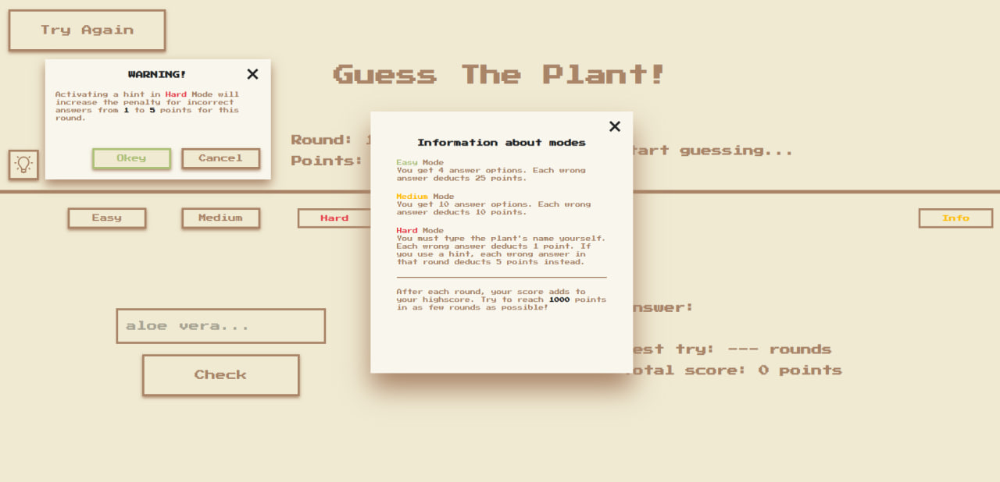

# 🌿 Guess The Plant

Fun quiz game to test your knowledge of plants! Choose a difficulty mode, guess the plant, and try to score 1000 points!

## 📸 Screenshots

### 🎮 Game in progress

## 🔧 Features

- 🪴 3 difficulty modes: Easy, Medium, Hard
- ❓ Hint system (with penalty in Hard mode)
- 🔁 Round-based gameplay
- 🏆 Victory animation after reaching 1000 points
- 🎉 Lottie-based celebratory animations
- 💡 Warning modal before using hints in Hard mode
- ✨ Responsive layout for desktop and tablets

## 🚀 Getting Started

Simply open `index.html` in your browser.

> No installation or dependencies required. All game logic is implemented in plain HTML, CSS, and JavaScript.

## 👨‍💻 Author

Created by [Andrii Fediai](https://github.com/FediaiAndrii)
